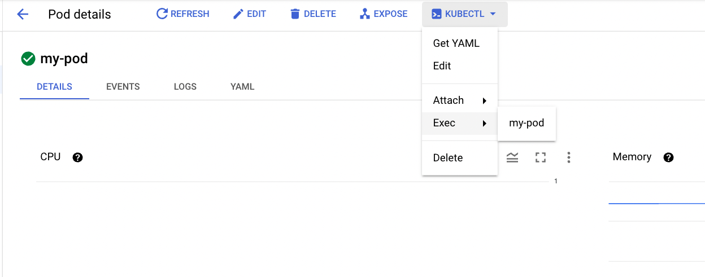

### Background

Since following [Open-metadata kubernetes deployment](https://docs.open-metadata.org/deployment/kubernetes) won't work on GKE and the reason is OpenMetadata helm chart depends on Airflow and Airflow expects a presistent disk that support ReadWriteMany (the volume can be mounted as read-write by many nodes).

### Solution

The workaround is to create nfs-server disk on GKE an use that as the presistent claim and delpoy OpenMetadata by implementing the following steps in order

##### Create disk on GKE

```
gcloud compute disks create --size=100GB --zone=<zone_id> nfs-disk
```

##### Deploy nfs-server pod

```
kubectl create -f nfs-server-deployment.yaml
```

make sure that the nfs pod is running

##### Create nfs service

```
kubectl create -f nfs-clusterip-service.yaml
```

##### Create persistent disk & persistent disk claim for airflow dags and airflow logs

```
kubectl create -f logs_pv_pvc.yaml
kubectl create -f dags_pv_pvc.yaml
```

##### Change owner and permission manually on disks

for that we need to deploy a container with bash and those disks mounted so we can change the perimission and ownership to user instead of root , as airflow need to access those disks by airflow user

```
kubectl create -f permissions_pod.yaml
```

on google cloud shell execute

```
gcloud container clusters get-credentials <cluster_name> --zone <cluster_zone --project <project_id>  && kubectl exec -it my-pod -c my-pod -- /bin/bash
```

or you can do that from gcp console itself

on the bash shell execute

```
chown -R 50000 /airflow-dags/ /airflow-logs/
chmod -R a+rwx /airflow-dags/  # if needed
```

##### Deploying OpenMetadata dependancies using custom values

- Adding secrets

```
kubectl create secret generic mysql-secrets --from-literal=openmetadata-mysql-password=openmetadata_password
kubectl create secret generic airflow-secrets --from-literal=openmetadata-airflow-password=admin

```

- Add OpenMetadata helm chart repo

```
helm repo add open-metadata https://helm.open-metadata.org/
```

- Create airflow secrets

```
kubectl create secret generic airflow-mysql-secrets --from-literal=airflow-mysql-password=airflow_pass
```

- Install OpenMetadata dependencies helm chart

```
helm install openmetadata-dependencies open-metadata/openmetadata-dependencies --values values-dependencies.yaml
```

Watch airflow and other dependencies running - ``Kubectl get pods -w``

- Install OpenMetadata helm chart

```
helm install openmetadata open-metadata/openmetadata
```

- Use port forwarding to forward OpenMetadata UI (port 8585 ) and airflow UI (port 8080)

```
kubectl port-forward <openmetadata pod name/id> 8585:8585
kubectl port-forward <airflow web pod name/id> 8080
```

##### References

https://docs.open-metadata.org/deployment/kubernetes

https://medium.com/@Sushil_Kumar/readwritemany-persistent-volumes-in-google-kubernetes-engine-a0b93e203180
